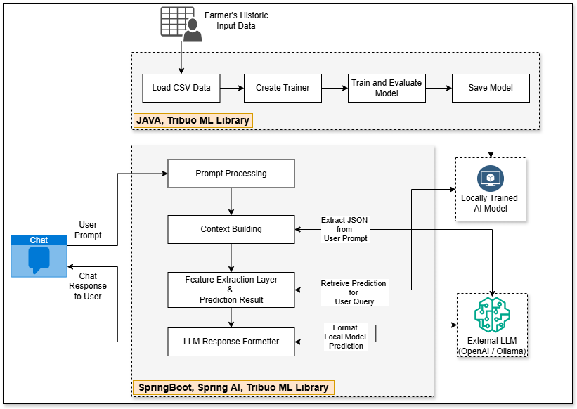

# <u>Project: Trend Analysis</u>

A Springboot and Spring AI based JAVA project to perform Trend analysis based on historic Input and Product data.

## Highlevel Architecture
</img>

## Technology Stack
* JAVA 17
* Tribuo Machine Learning Library
* Spring Boot
* Spring AI
* Spring Data JPA
* Spring Web
* H2 In Memory Database

## Activities

1. Create SpringBoot Project with Spring AI dependencies
2. Integrate H2 Database and make it work with Spring Data JPA
3. Integrate Machine Learning Model capabilities using <b>tribuo</b> library and perform below activities.
   1. Load CSV file, Create Trainer, Train Model, Evaluate the Model and Save to filesystem
   2. Run Prediction by passing Example data to the trained model and get the output
4. <b>DONE</b> Integrate Spring AI to add machine learning capabilities to the application
5. Create ChatController and ChatService to perform below activities.
   1. <b>/chat endpoint:</b> performs below activities.
      1. Accepts user Prompt
      2. Perform JSON Extraction by connecting to <b>OpenAI LLM</b>
      3. Create Feature and pass to trained model
      4. Get the predictions from Trained Model
      5. Pass Prediction to <b>OpenAI LLM</b> to convert prediction for user explanation
      6. Respond back to user with the final output from LLM
   2. <b>/api endpoint:</b> performs below activities.
      1. Accepts user input in JSON format
      2. Create Feature and pass to trained model
      3. Get the predictions from Trained Model
      4. Respond back to user with the final output in JSON format
6. Test the REST API using Postman
7. Use the trained machine learning model to make predictions in the REST API endpoints

## Curl command
### Prompt Format
```bash
curl --location 'http://localhost:8080/trend/chat' \
--header 'Content-Type: text/plain' \
--data 'I am growing soybean in Maharashtra in Kharif season, rainfall is 900mm, land size 5 acres'
```

### JSON Format
```bash
curl --location 'http://localhost:8080/trend/api' \
--header 'Content-Type: application/json' \
--data '{
"year": 2026,
"month": 6,
"crop_type": "Rice",
"soil_type": "Red",
"region": "Madhya Pradesh",
"season": "Kharif",
"rainfall": 900,
"farmer_land_size": 5,
"previous_input_usage": "Mancozeb"
}'
```

## References
* H2 Database URL: http://localhost:8080/h2-console
* https://www.baeldung.com/java-ml-tribuo-guide
